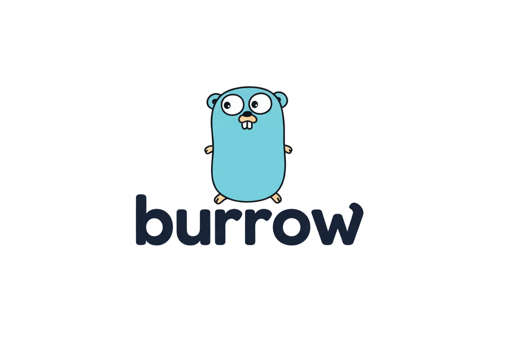

<h1 align="center">
  
  <br>
  Burrow
</h1>

<div align="center">

[](https://github.com/elaurentium/burrow/blob/main/LICENSE)
[](https://github.com/elaurentium/burrow/releases)
[](https://github.com/elaurentium/pitchshifter/releases)

</div>

**Burrow** is Directory/File Creation CLI Tool

Exemple:
```bash
b src/main.go
#/src
#  |            output
#   main.go
```